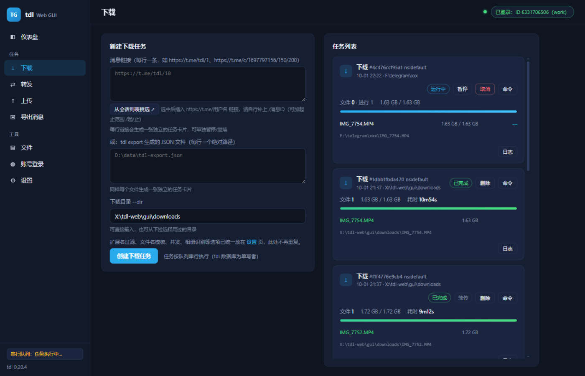

<div align="center">

# tdl Web GUI

**把 Telegram 命令行下载器 tdl，变成眼前这个好看的网页控制台。**

扫码登录 · 网页下载 · **在线播放** · 断点续传 · 实时速度 · 免命令行

[](#环境要求)
[](#环境要求)
[](https://github.com/iyear/tdl)
[](#技术栈)
[](#许可证)



<sub>界面预览：任务卡片实时显示进度、速度与落盘路径</sub>

</div>

---

## 这是什么？

[tdl](https://github.com/iyear/tdl) 是目前最好用的 Telegram 命令行下载器，但它也**只能**在命令行里用：

- 下载一个频道的历史文件，要手敲一长串参数
- 想看进度？盯着黑底白字的进度条
- 断网了想续传？研究 `--continue` 和它那套复杂的断点机制
- 登录？准备好手机扫码，还得手动把终端里的二维码对准摄像头

**tdl Web GUI 把这些全部搬进了浏览器**，而且**不需要你改动 tdl 一行代码**——它是一个纯外挂式的网页控制台，直接调用你已有的 `tdl.exe`。

> 适合已经在用 tdl、但受够了敲命令的人。

---

## 亮点功能

### 🚀 真正的字节级断点续传（这是重点）

市面上的 tdl 图形工具，甚至 tdl 自己，**都无法续传一个下到一半的文件**。

原因藏在 tdl 源码里：

```go
to, err := os.Create(path)   // O_TRUNC —— 打开即清空
```

它打开文件用的是 `os.Create()`，会**把已有文件截断**，并且整个下载路径里没有任何 `Seek` / `O_APPEND` / offset 处理。所以 tdl 的"续传"只是**跳过已完成的消息**，那个下到一半的大文件会**从 0 重下**。一个 1.8GB 的视频下到 90% 断了？抱歉，重来。

**本项目的解法**：tdl 的 `--serve` 模式（原本只是个 Beta 功能）**完整支持 HTTP Range 请求**。于是下载不再走 tdl 内部通道，而是：

```
启动 tdl dl --serve  →  从索引页拿到文件列表
      ↓
按 8MB 分块，并发 Range 请求，写入 <文件名>.part
      ↓
暂停 = 中止传输，.part 与块内偏移量都保留
      ↓
继续 = 只补下缺失的块，块内已下载的部分从该偏移接着传
```

实测：暂停时保留 34.5MB 进度，继续后从 34.5MB 一路涨到 407MB，**一字节都没浪费**。

### 📺 在线播放：不用等下完，边下边看

Telegram 官方客户端的视频播放是**限速**的，而且往往要**整个文件下载完**才能流畅播放——一个 1.8GB 的视频，你就干等着。

本项目让你**贴一条链接就能直接看**：

```
浏览器 <video>  ──Range──▶  流式代理  ──▶  tdl dl --serve  ──▶  Telegram
                  (206)      内存缓存 + 多连接预取池
```

**为什么不能直连？** tdl 的 `--serve` 确实支持 HTTP Range，浏览器 `<video>` 理论上能直接拉流。但实测**单条连接只有 ~0.1 MB/s**，而 1080p 码率要 1–3 MB/s——直连必定卡成幻灯片。

所以本项目在中间加了一层**流式代理**：

- **1MiB 分块 + 内存 LRU** —— 浏览器的每个 Range 请求都从缓存块应答
- **未命中时切 4×256KB 子分片并行取回**，边到边写响应 —— 起播只需等 ~256KB，而不是一整块（早期用 4MiB 整块时起播要等 ~30 秒）
- **16 条连接的后台预取池**，始终把播放头前方 ~96MB 填好 —— 实测热区 64MB 命中仅需 **51ms**
- **抗线路抖动** —— 代理线路成批 `ECONNRESET` 时，响应按块多轮重试。实测一个请求在 **219 秒**的线路中断中存活，恢复后仍完整送达

**边看边下**：勾选后会自动创建一个**普通下载任务**，播放器直接读取它 `.part` 里**已完成的块**，同一份数据绝不重复下载——看完的视频**同时也已经下载好了**，任务卡片上能看到完整进度。

> 播放和下载**可以同时进行**：播放会话使用登录会话的**独立副本**（`tdl migrate` 复制到单独目录），与下载任务各持各的数据库锁，互不阻塞。这是"边看边下"能成立的前提。

### ⚡ 跑满带宽的并行下载

单条 HTTP 连接有多慢？实测一个 1.7GB 文件：

| 并发连接 | 实测速度 |
|:---:|:---:|
| 1 | 0.1 MB/s |
| 8 | 1.2 MB/s |
| 16 | 2.8 MB/s |
| 32 | 3.4 MB/s |
| **48** | **5.4 MB/s** |

速度几乎与并发数成正比。本项目默认开 **48 条并发连接**（可调，上限 64），把带宽吃满。

### 🔐 网页里完成登录，重启不用再登

| 方式 | 说明 |
|---|---|
| **桌面端一键导入** | 直接读你本机 Telegram Desktop 的 `tdata`，**连账号昵称都帮你查好**（不是一串看不懂的数字 ID） |
| 扫码登录 | 二维码**直接渲染在网页上**，手机扫屏幕即可 |
| 手机号 + 验证码 | 验证码在网页输入框里填 |
| 两步验证（2FA） | 检测到密码提示时自动弹出输入框 |

**登录一次，长期有效**：tdl 的会话存在 `~/.tdl` 里本来就跨重启有效，本项目在启动时**主动探测会话是否可用**，并在界面上如实显示"已登录：某某某（重启后自动恢复）"。不会再让你以为掉线了而白白重登一次。

### 📋 还有这些

- **一键全局命令** `tdlw` —— 任意目录敲一下就在后台静默启动（不弹命令行窗口）并打开浏览器，**重复执行不会启动第二个进程**
- **在线播放** —— 贴链接直接看，不用等下完；可勾选「边看边下」，看完即已落盘
- **一个链接一张卡片** —— 粘贴 5 条链接得到 5 张独立任务卡，各自可暂停/继续/取消
- **落盘绝对路径** —— 每个文件都告诉你最终存到了哪里，下载完不用猜
- **设置持久化** —— 代理、目录、模板等所有配置存进 SQLite，刷新和重启都不丢
- **在线预览** —— 下载的图片/视频/音频可直接在"文件"页播放
- **零构建** —— 前端是原生 JS，没有 webpack/vite，改完刷新即可

---

## 快速开始

### 环境要求

- **Windows**（10/11）
- **Node.js 22+**（用到了内置的 `node:sqlite`）
- 一个能用的**代理**（直连 Telegram 通常不通）
- `tdl` 可执行文件 —— **不用手动准备**：首次启动后在设置页点「自动下载 tdl」即可，它会按你的系统与架构从 [tdl Releases](https://github.com/iyear/tdl/releases) 拉取对应版本并解压到 `gui/tdl/`。也可手动下载后放到项目目录，或在设置页填自定义路径。

### 三步跑起来

```bash
# 1. 装依赖（只有一个：node-pty）
cd gui
npm install

# 2. 启动
node server.js
```

打开浏览器访问 **http://127.0.0.1:8560**

### 可选：安装全局快捷命令

```bash
cd gui/bin
install-tdlw.bat
```

之后在任意目录：

| 命令 | 作用 |
|---|---|
| `tdlw` | 静默启动并打开浏览器（已在运行则只打开页面，无任何弹窗） |
| `tblw` | `tdlw` 的别名，两个名字等效 |
| `tdlw-stop` | 停止服务，释放数据库锁 |

> 用 VBScript + wscript 实现**完全无窗口**，比 `start /min` 彻底。
> 内置三重防重复启动：运行中检测 → 原子锁 → 陈旧锁自愈。

---

## 界面一览

| 页面 | 功能 |
|---|---|
| **仪表盘** | 账号状态、tdl 版本、执行队列、最近任务 |
| **下载** | 粘贴链接/选导出 JSON，实时进度+速度+落盘路径，暂停/继续 |
| **在线播放** | 贴链接直接点播，多连接预取供流，可选边看边下 |
| **转发** | clone / direct 模式、目标路由、文本改写、演练模式 |
| **上传** | 本地文件上传，支持话题与 caption 表达式 |
| **导出消息** | 按最近 N 条 / ID / 时间区间导出为 JSON |
| **文件** | 下载目录浏览器，图片视频音频在线预览 |
| **账号登录** | 四种登录方式，全部在网页完成 |
| **设置** | 代理、命名空间、并发数、扩展名过滤等 |

---

## 技术栈

**刻意保持极简**——运行时依赖**只有 1 个**：

| 层 | 选型 | 说明 |
|---|---|---|
| 后端 | Node.js 内置模块 | HTTP、SQLite、子进程全部用官方内置 |
| 终端 | **node-pty** | 唯一的第三方依赖，用 ConPTY 跑 tdl |
| 前端 | 原生 ES Module | 无框架、无打包器、无构建步骤 |
| 存储 | `node:sqlite` | Node 22+ 内置，无需编译原生模块 |

### 架构

```
gui/
├── server.js            HTTP 服务 + JSON API + SSE 实时推送
├── lib/
│   ├── tdl.js           tdl 执行器：ConPTY 启动、全局串行队列、进度解析
│   ├── serve-dl.js      并行 Range 下载 + 断点续传引擎
│   ├── stream.js        在线播放：流式代理 + 多连接预取池 + 边看边下
│   ├── tasks.js         任务引擎：状态机、暂停/继续、速度计算
│   ├── login.js         交互登录：QR 捕获、验证码注入、会话恢复
│   ├── db.js            SQLite 持久化（4 张表）
│   ├── config.js        配置管理
│   ├── desktop.js       桌面端账号探测与昵称查询
│   ├── files.js         下载目录浏览（路径钳制）
│   └── chats.js         会话列表缓存
├── public/              前端 SPA（原生 JS）
└── bin/                 tdlw 全局命令安装脚本
```

### 几个值得说的实现细节

**1. 为什么所有 tdl 调用都跑在终端里？**

tdl 的交互式登录（手机号/验证码/2FA）用的是 `survey` 库，**在管道下会直接报错**。所以本项目把**每一次** tdl 调用都放进 ConPTY 虚拟终端，登录提示才能被捕获和回填。

**2. 为什么任务要排队？**

tdl 使用 bolt 数据库，**同一时间只允许一个写入进程**。实测第二个 tdl 会直接报 `database is used by another process`。所以所有调用都经过一个**全局串行队列**。这也意味着多个任务无法真正并行启动，只能在内部并发（这正是并行 Range 下载的用武之地）。

**3. 为什么终端宽度设成 400 列？**

tdl 的进度表会把超长内容截断。文件落盘的绝对路径就藏在进度行里，宽度不够时会变成 `F:\telegr~`。设成 400 列后路径才完整可见。

**4. 扩展名过滤的坑**

tdl 的 `--include` 按**原始大小写**精确匹配。文件叫 `IMG_7710.MP4` 时，`--include mp4` 匹配不上，会**静默跳过所有文件**且退出码仍为 0。本项目会自动同时传大小写两种形式。

**5. 在线播放为什么要自己写一层代理？**

因为 `tdl --serve` 的**单连接速度撑不起实时播放**（~0.1 MB/s vs 1080p 需要的 1–3 MB/s）。代理层用 16 条并发连接预取 + 内存分块缓存把速度提上来，并用 1MiB 小块（未命中再切 256KB 子分片）把起播延迟压到最低。播放和下载**共享同一份 `.part`**：勾选边看边下时，代理优先从下载任务已完成的块读数据，只有没下到的部分才走网络。

**6. 播放与下载如何同时进行？**

tdl 的 bolt 数据库**只允许一个写入进程**（见第 2 条），播放会话和下载任务会互相抢锁。解法是把登录会话用 `tdl migrate` **复制**一份到独立目录，播放进程使用这份副本——两者持有**不同的**数据库锁，因此可以同时运行。会话副本会在空闲时自动刷新，登录状态变化也能跟上。

---

## 常见问题

<details>
<summary><b>显示"未登录"但其实登录过？</b></summary>

启动后需要几秒探测会话。若持续显示未登录/已失效，点登录页的「重新检测」按钮。
</details>

<details>
<summary><b>任务一直"排队中"？</b></summary>

受 tdl 数据库单写者限制，同一时间只跑一个任务，其余排队。等前一个完成即可。
</details>

<details>
<summary><b>速度上不去？</b></summary>

先在设置页把「并发连接数」调到 48–60。如果仍然慢，瓶颈很可能在你的代理链路——测一下代理本身的吞吐：

```bash
curl -o /dev/null --proxy socks5h://127.0.0.1:7890 -w "%{speed_download} B/s\n" <某个大文件URL>
```

若代理本身只有几百 KB/s，那就是链路限制，换节点比调参数有效。
</details>

<details>
<summary><b>提示"没有匹配到任何文件"？</b></summary>

多半是扩展名过滤把文件都排除了，或链接里确实没有媒体。检查设置页的「仅包含扩展名」。例如填 `mp4` 会同时匹配大写的 `.MP4`。
</details>

<details>
<summary><b>播放时卡顿、起播慢？</b></summary>

先确认不是代理链路在抖（见上一问的测速方法）。播放用的是 16 条连接的预取池，可在设置页把「播放预取连接数」调高（上限 64），或加大「预取窗口」。另外**首次起播**和**大幅拖动进度条**需要等待数据取回，是正常现象。
</details>

<details>
<summary><b>某些视频点了播放但播不出来？</b></summary>

浏览器只能解码 **mp4 / webm** 等容器。mkv、avi 这类 Telegram 上常见的格式浏览器原生不支持（列表里会标注扩展名，勾选「只看可播放的音视频」可过滤）。文件本身没问题，下载下来用本地播放器即可。
</details>

<details>
<summary><b>在线播放和下载会互相抢资源吗？</b></summary>

不会。播放会话跑在登录会话的**独立副本**上，与下载任务持有不同的数据库锁，可以同时进行。播放会话在空闲（默认 10 分钟）后自动关闭并释放资源。
</details>

<details>
<summary><b>能改成局域网访问吗？</b></summary>

可以，但要注意：API **没有身份校验**。请自行加反向代理和鉴权，**不要直接暴露到公网**。
</details>

---

## 安全说明

- 默认只监听 `127.0.0.1`，本机可访问
- **不收集、不上传任何数据**，所有配置和任务记录都在本地 SQLite
- `.gitignore` 已排除 `gui/data/`（含登录记录、代理配置）、下载内容、密钥文件
- 服务端发起的所有 HTTP 请求都**限定为 loopback 地址**（本地 tdl serve 进程）；播放代理的请求目标由**硬编码回环主机 + 整数端口**构造，不接受外部输入
- 用户提供的链接只作为 `tdl` 的命令行参数传递，本项目**不直接请求**这些链接；仅接受 `t.me` 消息链接形态
- 口令类输入（2FA 密码、passcode）不会被持久化

---

## 已知限制

- **仅 Windows**：`tdlw` 脚本用 VBScript，`tdl.exe` 也依赖 Windows 路径（tdl 本身支持 Linux/macOS，可自行指定路径运行）
- **任务串行**：受 tdl 数据库单写者限制，多个任务排队执行（在线播放不受此限制，见上文）
- **播放格式受限**：浏览器只能直接播放 mp4/webm 等容器，mkv/avi 需下载后用本地播放器
- **无时长/缩略图**：文件列表只显示文件名与大小，暂无时长、分辨率、缩略图（需要额外解析消息元数据）
- **4K 播放取决于线路带宽**：播放代理能跑满可用带宽，但 4K 实时播放需 ~15 MB/s，带宽不足时会持续缓冲
- 依赖 tdl 的 `--serve` 模式，该功能在上游标记为 Beta
- 需要自备代理

---

## 致谢

- [iyear/tdl](https://github.com/iyear/tdl) —— 本项目的基石，没有它就没有这一切
- [gotd/td](https://github.com/gotd/td) —— 强大的 Telegram MTProto 客户端库
- tdl 的 `--serve` 模式作者 —— 那个 HTTP Range 支持是断点续传的关键

---

## 许可证

本项目采用 **AGPL-3.0** 许可证，与上游 [tdl](https://github.com/iyear/tdl) 保持一致。

---

<div align="center">

**如果这个项目帮你省下了一些敲命令的时间，欢迎点个 ⭐ Star**

[⬆ 回到顶部](#tdl-web-gui)

</div>
